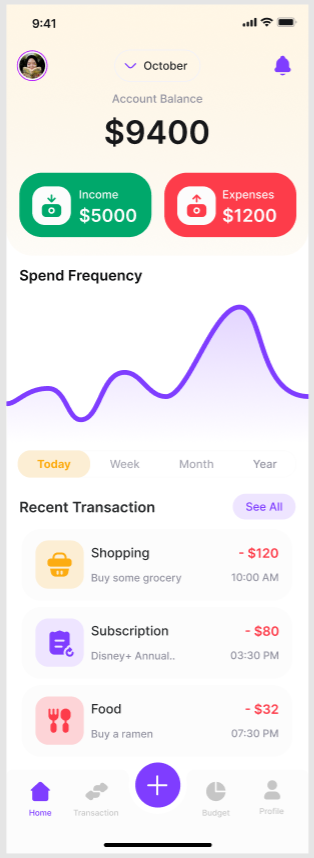
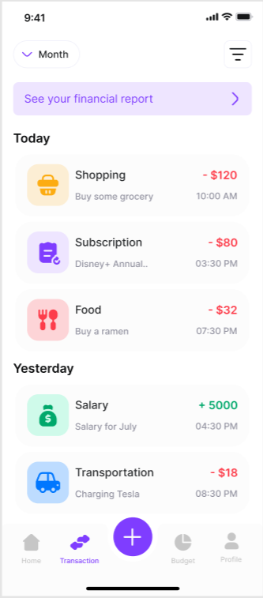
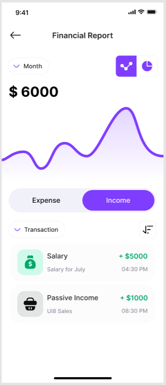
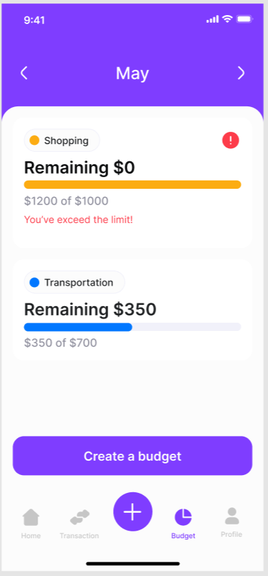

# 📊 Montra

## 🚀 Overview

The **Financial Manager App** is a **Flutter** application that helps users track their **expenses, income, transactions, budgets, and financial goals**. It provides an intuitive and modern UI for managing personal finances effectively.

## ✨ Features

- **💰 Expense & Income Tracking**: Keep track of your expenses and income with categorized transactions.
- **📊 Interactive Graphs & Pie Charts**: Visualize your spending habits using graphs and pie charts.
- **🔄 Recurring Transactions**: Set up automated transactions for subscriptions, salaries, etc.
- **📁 Attachments**: Upload receipts and invoices for better expense management.
- **📅 Budget Management**: Create, update, and track budgets to control your spending.
- **🔔 Notifications & Alerts**: Get alerts when your budget exceeds limits or new transactions occur.
- **🌎 Multi-Currency & Multi-Language Support**: Choose your preferred currency and language.
- **🎨 Light & Dark Theme**: Customize the UI with different themes.
- **🔐 Security Settings**: Enable PIN, fingerprint, or Face ID authentication for secure access.

## 📸 Screenshots

| Home Screen                          | Expense Tracking                       | Financial Report                       | Budgeting                              |
| ------------------------------------ | -------------------------------------- | -------------------------------------- | -------------------------------------- |
|  |  |  |  |

## 🛠 Tech Stack

- **Flutter** (Dart)
- **State Management**: Bloc
- **Local Database**: SQLite
- **Networking**: HTTP, REST APIs
- **Charts & Graphs**: fl_chart
- **UI Components**: Flutter ScreenUtil, Google Fonts

## 🔧 Installation

```sh
# Clone the repository
git clone https://github.com/chiragdhunna/montra

# Navigate to the project directory
cd financial-manager

# Install dependencies
flutter pub get

# Run the app
flutter run
```

## 📂 Project Structure

```
📦 montra
├── 📂 lib
│   ├── 📂 constants                    # Constants and global variables
│   ├── 📂 screens
│   │   ├── 📂 notification             # Notification settings screen
│   │   ├── 📂 on_boarding              # Onboarding flow
│   │   ├── 📂 splash                   # Splash screen
│   │   ├── 📂 user_screens
│   │   │   ├── 📂 budget_screens       # Budget-related screens
│   │   │   ├── 📂 financial_reports    # Expense & income reports
│   │   │   ├── 📂 income_or_expense    # Income & expense tracking
│   │   │   ├── 📂 profile_section
│   │   │   │   ├── 📂 account_screens  # Account management
│   │   │   │   ├── 📂 export_screens   # Export data & backup
│   │   │   │   ├── 📂 settings_screens # App settings (theme, currency, security)
│   ├── 📂 widgets                      # Reusable UI components
│   │   ├── transaction_card.dart        # Transaction list card
│   │   ├── budget_card.dart             # Budget list card
│   ├── 📂 models                       # Data models
│   ├── 📂 services                     # API and database services
│   ├── 📂 utils                        # Helper utilities
│   ├── main.dart                       # Entry point of the application
└── pubspec.yaml                        # Flutter dependencies & configurations

```

## 🚀 How to Use

1. **Add Transactions**: Log your daily expenses and income.
2. **Analyze Reports**: Use charts and graphs to monitor spending trends.
3. **Set Budgets**: Control your finances by setting up budgets.
4. **Customize Settings**: Change currency, theme, and security preferences.

## 📌 Future Enhancements

- **🛢 MySQL / PostgreSQL Database Integration**
- **🌍 Backend Powered by Node.js**
- **🔄 Cloud Data Sync using Secure APIs**

## 🙌 Contribution

Feel free to contribute by **creating pull requests** or **reporting issues**.

---

Made with ❤️ by [Chirag Dhunna](https://github.com/chiragdhunna) 🚀
